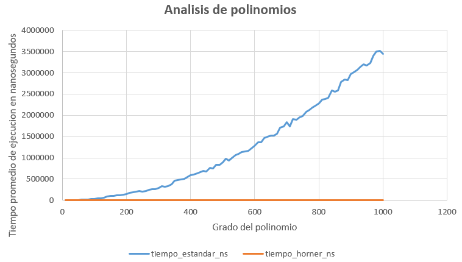

# Análisis de Rendimiento en la Evaluación de Polinomios

## Descripción
Este proyecto compara experimentalmente la eficiencia computacional de dos algoritmos para evaluar polinomios:

- **Método Estándar**: Evalúa el polinomio término a término, calculando cada potencia de \(x\) de forma explícita.
- **Método de Horner**: Optimiza la evaluación mediante una forma anidada que reduce considerablemente la cantidad de operaciones aritméticas requeridas.

Se realizaron pruebas para polinomios de grado entre 10 y 1000, generando coeficientes aleatorios y evaluando los polinomios en un punto \(x \neq 0\). Los tiempos de ejecución promedio se almacenaron para análisis posterior.

---

## Autor(a)
Paulina Bojorquez Trujillo

---

## Requisitos del sistema
- Compilador C++ (recomendado: **g++ versión 9.4.0** o superior).
- Sistema compatible con C++11 o posterior.
- No se requieren bibliotecas externas adicionales.

---

## Instrucciones de compilación y ejecución

## 1. Clonar el repositorio
```bash
git clone https://github.com/princessspau/Analisis-de-rendimiento-en-la-evaluacion-de-polinomios.git
```
## 2. Entrar al directorio del proyecto

```bash
cd Analisis-de-rendimiento-en-la-evaluacion-de-polinomios
```
### 3. Compilar el código
```bash
g++ -o evaluador evaluacion_de_polinomios.cpp -O3
```

### 4. Ejecutar el experimento
```bash
./evaluador
```
### Descripción de los Algoritmos de Evaluación Polinomial
Método Estándar (Evaluación Directa)
Este método evalúa el polinomio calculando cada término de forma independiente y sumando los resultados. Para un polinomio P(x) = aₙxⁿ + aₙ₋₁xⁿ⁻¹ + ... + a₁x + a₀:

Calcula cada potencia xⁱ desde cero para cada término

Multiplica cada potencia por su coeficiente correspondiente aᵢ

Suma todos los términos calculados

Características clave:

Implementación sencilla y directa

Requiere recalcular potencias para cada término

Complejidad computacional: O(n²) operaciones

Ideal para entender el concepto básico de evaluación polinomial

Ineficiente para polinomios de alto grado

### Método de Horner (Evaluación Anidada)
Este método optimizado reorganiza el polinomio para minimizar las operaciones:

P(x) = (...((aₙx + aₙ₋₁)x + aₙ₋₂)x + ... + a₁)x + a₀

Características clave:

Evita el recálculo redundante de potencias

Solo requiere n multiplicaciones y n sumas (O(n) operaciones)

Más eficiente en tiempo de ejecución

Mejor estabilidad numérica

Forma óptima para evaluar polinomios en aplicaciones reales

Recomendado para polinomios de cualquier grado, especialmente altos

## Ventaja principal:
El método de Horner reduce significativamente el número de operaciones necesarias, lo que se traduce en un mejor rendimiento, como demuestran los resultados experimentales en este proyecto.

## Gráfica comparativa:



### Gráfica comparativa de desempeño

La gráfica muestra el tiempo promedio de ejecución (en nanosegundos) de ambos métodos al evaluar polinomios de distintos grados. Se observa que:

- El **método estándar** incrementa su tiempo de forma cuadrática conforme crece el grado del polinomio.
- El **método de Horner** mantiene un tiempo prácticamente constante, mostrando una gran eficiencia.

Esto evidencia la superioridad del método de Horner, especialmente para polinomios de alto grado.

## Análisis de resultados

Los resultados experimentales muestran una diferencia notable entre el método estándar y el método de Horner en términos de tiempo de ejecución.

- El **método estándar** presenta un crecimiento acelerado en el tiempo de evaluación a medida que aumenta el grado del polinomio. Esto se debe a que, para cada término, se realizan múltiples multiplicaciones para calcular las potencias de \(x\), lo cual implica una **complejidad algorítmica cuadrática** aproximadamente \(O(n^2)\).

- En contraste, el **método de Horner** mantiene tiempos de ejecución consistentemente bajos, incluso para polinomios de grado 1000. Este comportamiento refleja su **eficiencia lineal** \(O(n)\), ya que evita cálculos redundantes al reorganizar el polinomio en forma anidada.

- En la gráfica comparativa se puede observar que el tiempo del método estándar supera fácilmente el millón de nanosegundos para grados altos, mientras que el tiempo del método de Horner se mantiene cercano a cero en la misma escala.

### Comparación de escalabilidad
- A medida que el grado del polinomio aumenta, la diferencia entre los tiempos de ambos métodos se amplifica.
- Esto indica que el método de Horner no solo es más rápido, sino que **escala mucho mejor** en problemas de mayor tamaño.

### Interpretación práctica
- Para aplicaciones donde el rendimiento es crítico (como simulaciones numéricas, procesamiento de señales o computación científica), el uso del método de Horner puede generar mejoras significativas en tiempo de ejecución.

## Conclusiones

El análisis experimental realizado sobre la evaluación de polinomios confirma de manera contundente la **eficiencia del método de Horner** frente al enfoque estándar término a término. A través de la recolección de tiempos de ejecución promedio para grados de polinomios desde 10 hasta 1000, se ha observado que Horner no solo ejecuta más rápido, sino que **mantiene una tasa de crecimiento mucho menor** conforme aumenta el grado del polinomio.

El método estándar implica múltiples multiplicaciones por término debido al uso explícito de potencias de \(x\), lo cual genera una **complejidad algorítmica de orden cuadrático** \(O(n^2)\). Esto provoca que el tiempo de evaluación crezca rápidamente con el grado del polinomio, volviéndose ineficiente para entradas grandes.

Por el contrario, el método de Horner reestructura el polinomio para evitar potencias, realizando únicamente **una multiplicación y una suma por coeficiente**, lo que resulta en una **complejidad lineal** \(O(n)\). Esta diferencia se hace evidente en la gráfica comparativa, donde Horner muestra tiempos bajos y estables incluso en grados altos, mientras que el método estándar se vuelve progresivamente más lento.

Además, el comportamiento observado coincide con la teoría de complejidad, validando que la optimización algorítmica puede traducirse en mejoras concretas y medibles en rendimiento. Esto resulta especialmente relevante en contextos donde se evalúan polinomios de manera repetitiva o en aplicaciones de tiempo real.

En resumen:

- El método de Horner es **más eficiente, escalable y estable**.
- El método estándar se vuelve **rápidamente ineficiente** conforme aumentan los grados.
- La elección del algoritmo tiene un **impacto directo en el desempeño del software**, especialmente con grandes volúmenes de datos.

Por estas razones, se recomienda ampliamente **utilizar el método de Horner** para la evaluación de polinomios en cualquier aplicación que demande eficiencia y rendimiento.


